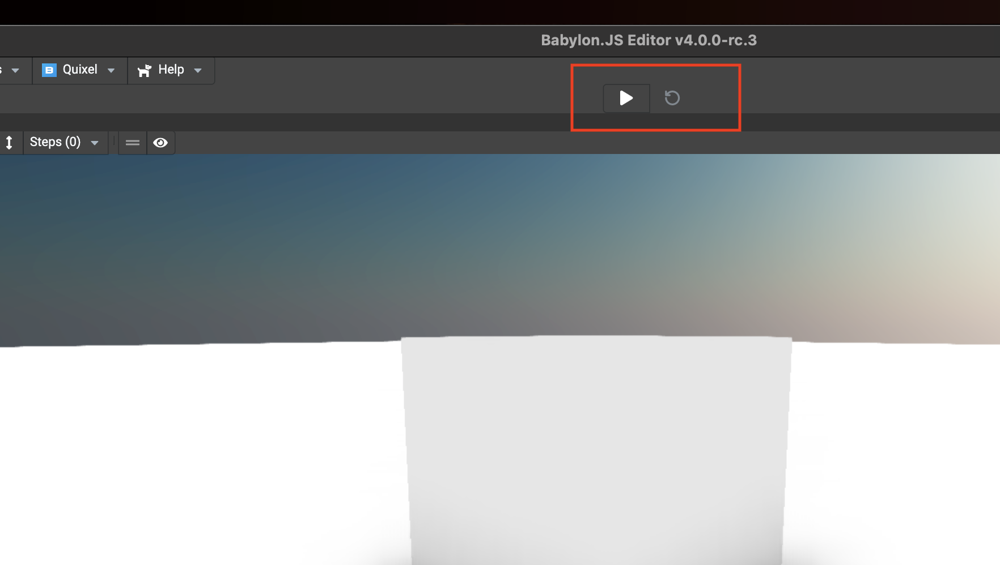

# Playing scene

Since Babylon.JS Editor v4.0.0-rc.3, it is possible to play directly the scene that is being edited in the Editor. This means the scene, as it is in the Editor, can be played directly including all scripts that are attached in the scene. This is particularely useful to test the scene itself and see if the scripts/components are working as intended.

## Playing the scene
At the middle of the tools toolbar, there are 2 buttons:
- Play / Stop (on the left) that generates the scene and plays the scene in the Editor's preview panel.
- Restart (on the right) that simply reloads the scene to be played.

Once the play button is clicked, the scene being edited in the preview panel disappears to let the test scene being visible. Once the scene to test is loader, you can play the scene and see if all scripts are working as intented.

## Debugging the scene
All templates in the Editor offer the way to debug TypeScript code directly in VSCode. Just type F5 and place break points or "debugger;" in your code.

**Note: type F5 before running the scene as the remote debugger will not (sometimes) be able to attach the process created on the fly to run the scene.**

Once VScode is attached to the Editor, let's run the scene and debug your code using your favorite shortcuts and debugging tools:

